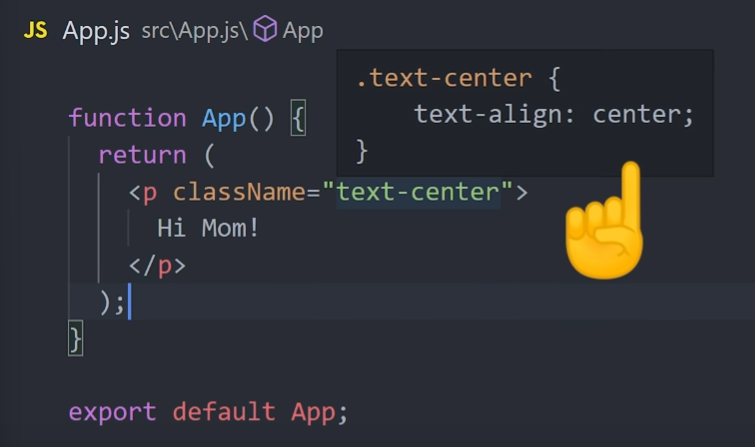
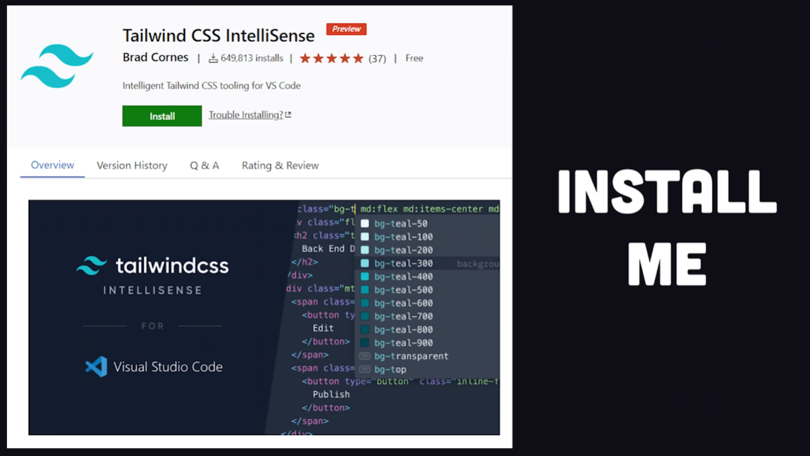
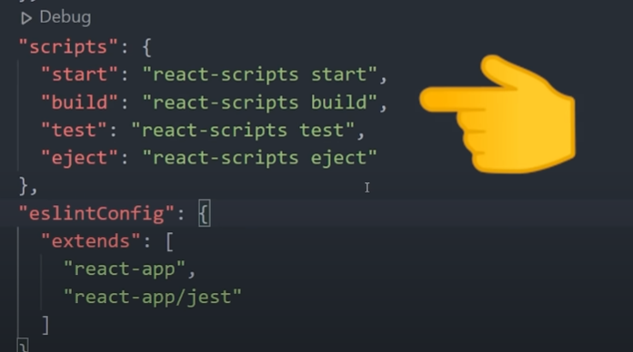
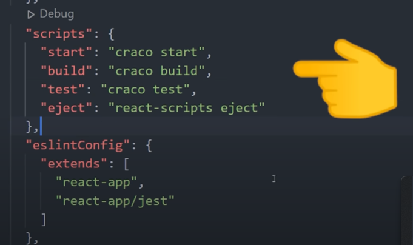
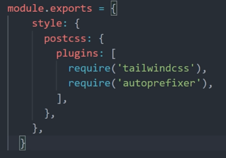
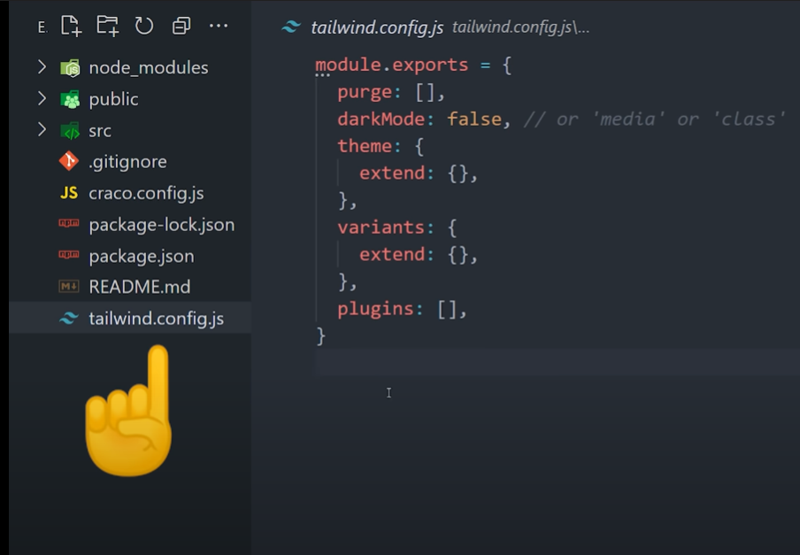
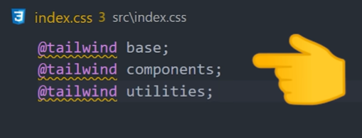
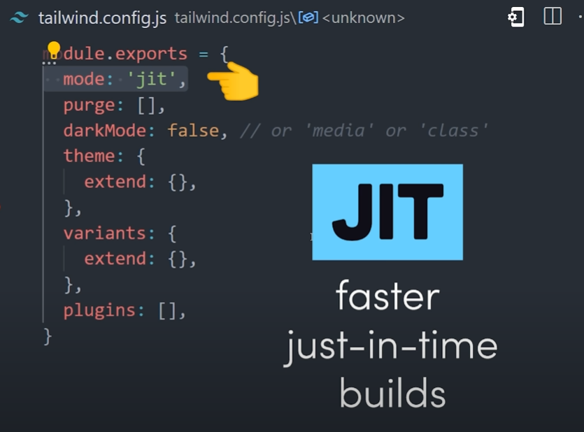
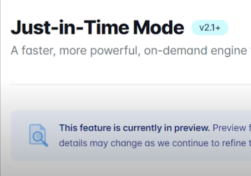

# TailwindCSS

<hr>


## O que é e porque usá-lo?

É uma enorme coleção de classes utilitárias, comparando com o CSS, permite que você escreva menos código no geral e tem padrões que o impedem de produzir código morto. No entanto, o tailwind não fornece componentes pré-construídos como o Bootstrap, isso significa que provavelmente levará mais tempo para construir uma interface do usuário do que o bootstrap, mas oferece um controle muito maior sobre a personalização.

Algumas pessoas dizem que Tailwind não é para iniciantes, mas eu meio que mudei de ideia sobre isso. O conjunto de ferramentas se tornou realmente excepcional. Quando você passa o mouse sobre uma classe no VSCode, ele diz exatamente o CSS que está dentro.



É como um css com rodinhas de treinamento e te ajudará a eliminar MUITO código morto, para que você não fique com um css enorme quando for para a produção.

No final das contas, o tailwind é para desenvolvedores que desejam que coisas altamente personalizadas sejam FEITAS MAIS RÁPIDO.


<hr>


Não deixe de instalar a extensão do InteliSense do Tailwind





Uma das principais razões do Tailwind ser tão popular, é porque ele funciona muito bem com Frameworks javascript baseadas em componentes.


Task List 

- [ ] Crie um projeto com sua FrameWork preferida `npx create-react-app nomedoprojeto`.
- [ ] `npm i -D tailwindcss@npm:@tailwindcss/postcss7-compat postcss@^7 autoprefixer@^9`
- [ ] `npm i @craco/craco`
- [ ] Substitua os `react-scripts` por craco no arquivo package.json






- [ ] Crie um arquivo chamado `craco.config.js` na pasta raiz do seu projeto

  

  

  

- [ ] Rode `npx tailwindcss-cli@latest init` para criar um arquivo de config Tailwind



- [ ] Finalmente, vamos ao index.css para incluir os estilos Tailwind ao nosso projeto




Parece muito trabalho para a configuração inicial, mas eu garanto que vale a pena!


## Entendendo os arquivos criados


Vamos começar abrindo o arquivo `tailwind.config.js`. Esse arquivo é usado para personalizar o comportamento do Tailwind, nele é possível customizar cores, adcionar plugins, e um monte de outras coisas. Uma das mudanças que podemos fazer logo de cara, é habilitar o modo `JIT - Just in Time`




Essa função ainda está no modo Developer Preview, e o que ela vai fazer é compilar seu CSS "on the fly", fazendo seu tempo de Build ser MUITO mais rápido




Outra coisa que podemos fazer, é dizer ao Tailwind para expurgar (purge) qualquer tipo de css que não esteja sendo usado no nosso `final bundle`. Esse passo só é relevante se de fato pretendemos mandar nosso código para produção!

```javascript
module.exports = {
    mode: 'jit',
    purge: ['./src/**/*.{js,jsx,ts,tsx}', './public/index.html'],
    darkMode: false, // or 'media' or 'class',
    theme: {
        extend: {},
    },
    variant: {
        extend: {},
    },
    plugins: [],
}
```


Agora finalmente temos tudo pronto para começar a usar!

